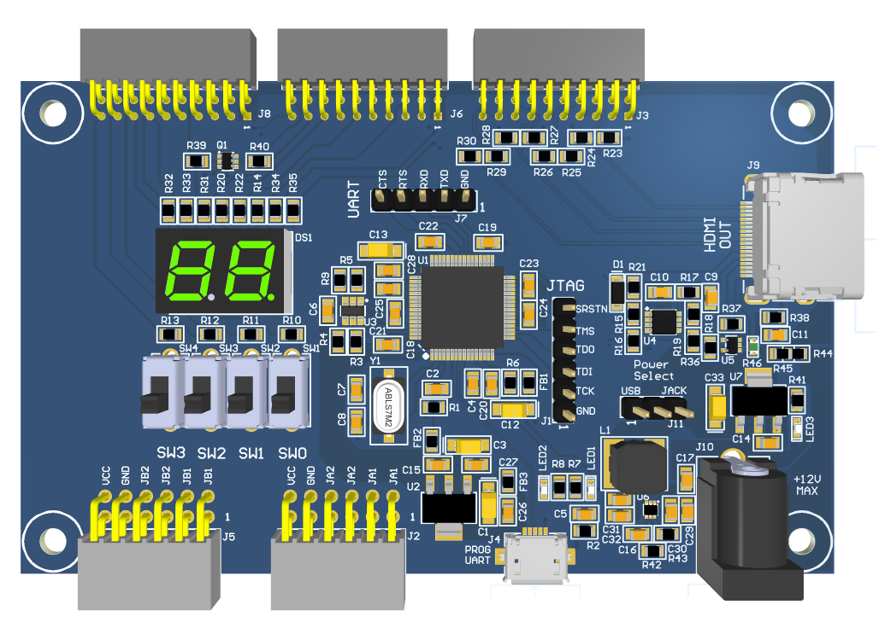
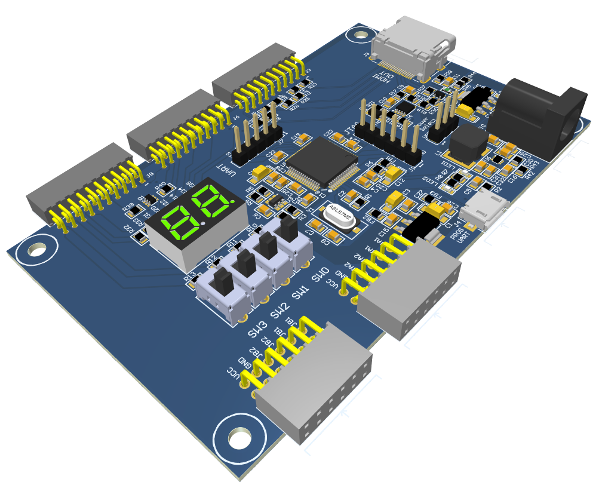
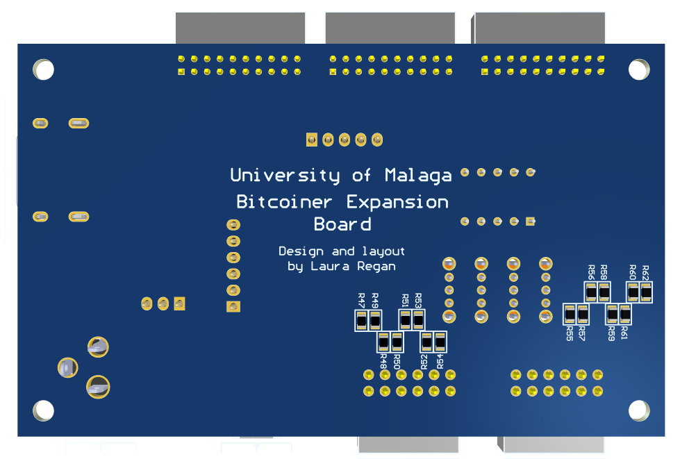

# Bitcoiner Expansion Board

This repository contains the Altium Designer project for an expansion board for the [EBAZ4205](https://github.com/xjtuecho/EBAZ4205) bitcoin miner board which contains a Zynq 7010 SoC+FPGA. The purpose of the board is to expand the functionality of the bitcoin miner, allowing easy access to the Zynqs PL (Programmable Logic) pins via PMOD connectors and provide a HDMI output so that the board can be used for image processing research. The board also includes four switches and a two digit seven segment display to be used for debugging of the board and also to be used by students in a introductory digital design class. To facilitate programming and debugging of the FPGA and ARM processor a FT2232H based JTAG programmer was included on the board. The FT2232H chip has two channels and the second is used as a UART connection to allow communication between the ARM processor and a PC. 

The board also has a buck converter allowing it to be powered by a 12V power supply. A jump connector on the board allows the either USB or DC jack to be used as the power source.

The board has 4 layers and the stackup is the following:  
Layer 1: Signal  
Layer 2: GND  
Layer 3: GND  
Layer 4: Signal

Also included in the repository is a PDF of the schematic, PDFs of the PCB layout, a 3D PDF of the PCB, and the Gerber/NC Drill files for the PCB.

## PCB Renders

## PCB Layout

